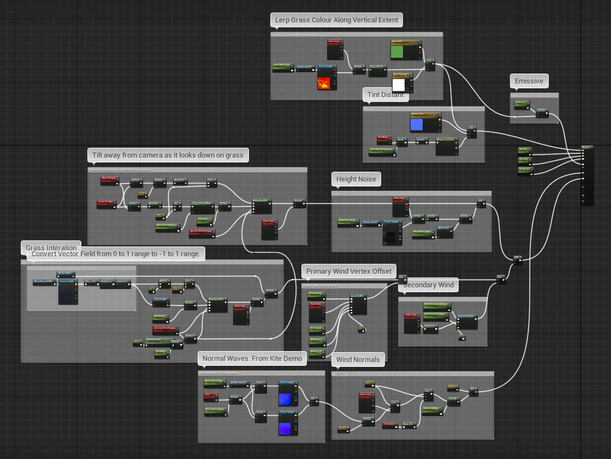
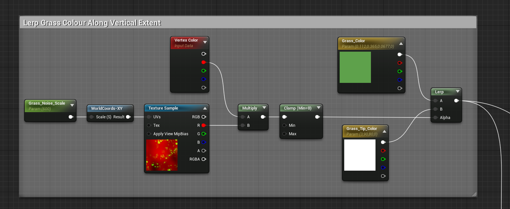
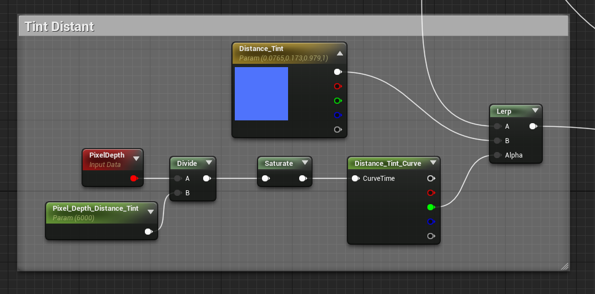
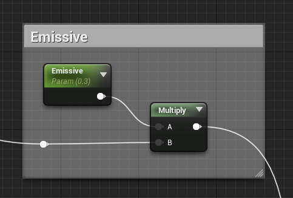
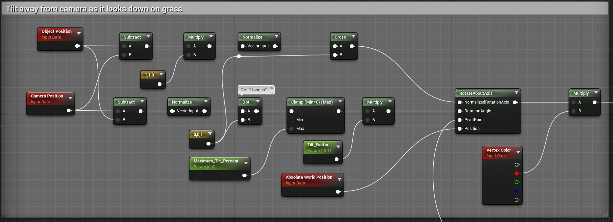
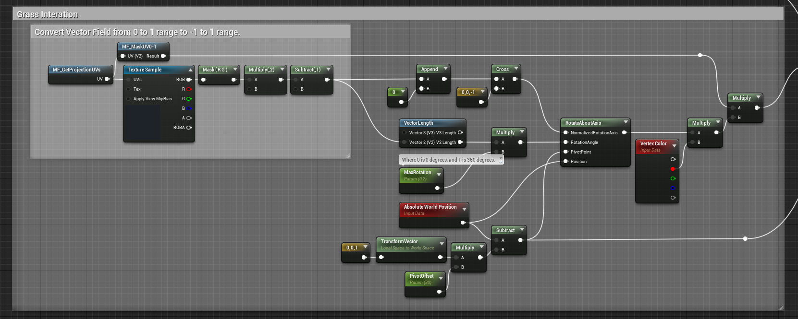
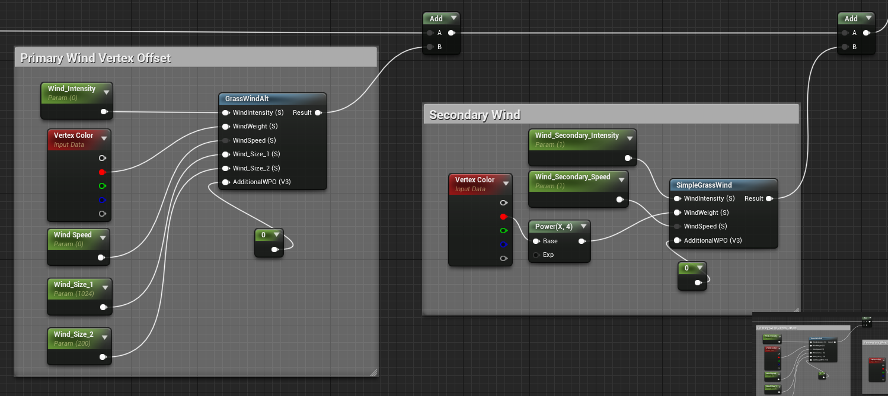

# Unreal Engine 4 Stylized Grass

Stylized grass made in UE4.

-VIDEO GOES HERE-

Trees are from Lui's [Trees Library](https://forums.unrealengine.com/community/community-content-tools-and-tutorials/82804-free-trees-library).

Expand to see the entire graph

## Breakdown

### Color

Expand to see

Here a worldspace noise texture is combined with vertex colours to fade grass colour between the root and tip. There is no diffuse texture.

At distance, we colourize the grass towards a tint colour. This is driven by curve (LUT) to make the effect non-linear.

### Emissive

Expand to see

This takes the untinted grass colour and reduces it before piping directly into emissive. This helps ensure some amount of grass colour is visible even at distance or in shadow.

### Camera Tilt

Expand to see

Tilts the grass away from the camera at harsher angles. Intended to hide the gaps between blades when looking straight down.
Pivot point is an estimated position above the grass and comes from the Grass Interaction step.

This is based on [this GDC talk](https://youtu.be/wavnKZNSYqU?t=1156) about the foliage of Horizon: Zero Dawn.

### Height Variation

Expand to see

This step applies a non-animated variation to height. This same effect can be created using the UE4 placement tool, so to really justify this step, some amount of animation or something should probably be added.

As-is, voronoi noise creates congruent ridges and peaks, implying the grass is doing really well in some places. True 'ridge noise' might be a good fit here.

### Grass Interaction

Expand to see

To affect grass, actors can release particles with a vector field texture. As long as these particles draw to custom depth, they will be captured by a downward-facing orthographic camera. This is written to a render texture which the grass samples from. Directionality can the be found by un-projecting the vector field, which is then used to rotate the grass about its axis.

This approach has some benefits. For example, particles could be spawned for explosions to create shockwaves or other wind effects. Currently there is just one pre-made vector field texture, which only matches to circular objects. To handle more complex shapes, these fields could be generated on the fly. Potentially a simpler approach is just to use a depth buffer comparison, like you see with snow footprint simulations. This would lose the outward splay of grass blades, though.

This is based on the grass interaction described by Tommy Tran, found [here.](https://www.raywenderlich.com/6314-creating-interactive-grass-in-unreal-engine-4)

### Wind

Expand to see

We also apply two levels of wind. One at scene-scale and another for smaller perturbations to imitate  localized gusts of wind. Both use vertex colours to avoid shifting the root of the grass around.

### Normal Movement

Expand to see

This technique also comes from the Kite demo.
We use two scrolling normal maps to create a wind-like effect that shifts the grass normals around (at rest, these normals point straight up).
As the normals animate, dark regions appear, which can look like wind, or cloud shadows.

